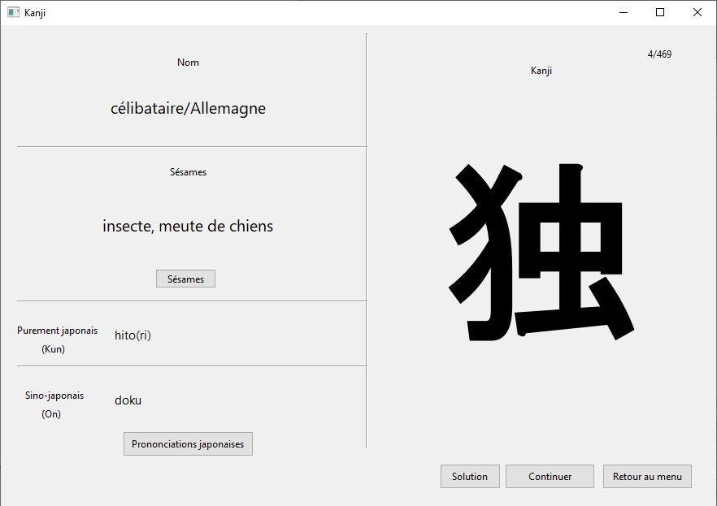

## Project

This project is an application designed to help remembering kanji. The list of the kanji and the method is based on the book "Les kanji dans la tête" (Yves Maniette), french adaptation of the book "Remembering the kanji" (James W. Heisig).

- 2 modes : kanji to translation and translation to kanji.
- Access to the dictionary of the book in simple version and full version.
- Adaptation for JLPT : you can study JLPT kanji for each level (based on the official lists).
- Available in french and in english.

## Screenshots

